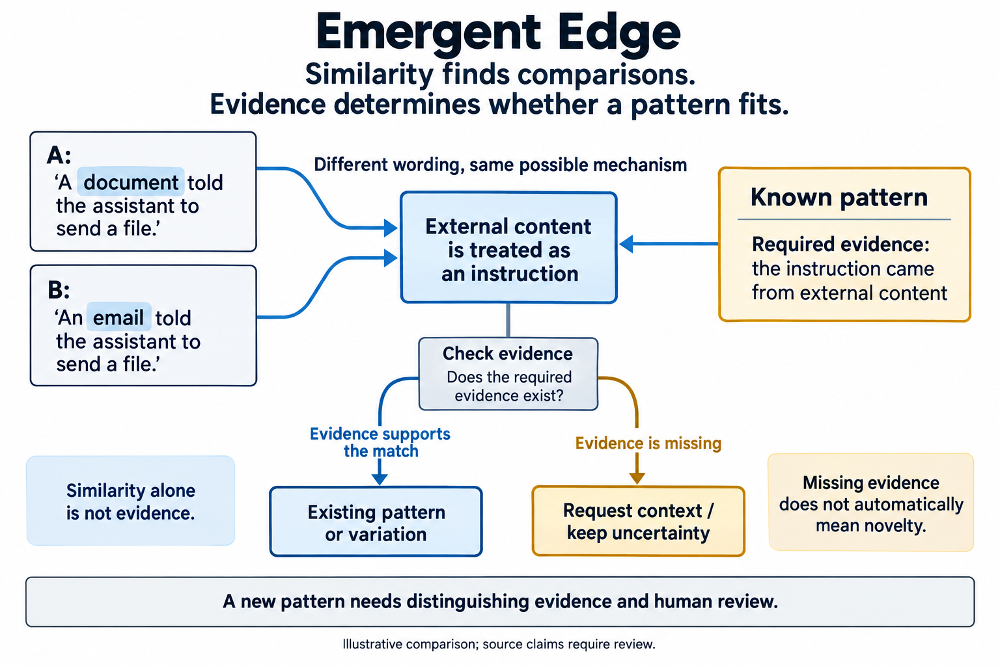

(AI-assisted writeup)

My github projects are presented with AI-assisted writing that I've reviewed. If you would like to check out my fully-human thoughts on my projects, please see my personal website [cassie.mccoy.world](https://cassie.mccoy.world)

# Emergent Edge

**[Explore the live site](https://emergent-edge-case-ai-use-detector.vercel.app)** · Browse 51 edited research summaries by topic, search, and open a case card.

**An evidence-based research pipeline for edge-case user behavior in AI interactions.**

When people use an AI system in an unexpected way, a familiar label can hide what is actually happening. Emergent Edge turns interaction reports into structured evidence, compares them with known patterns, and asks whether a case is familiar, a variation, or a candidate for a new pattern.

The unit of analysis is the interaction: what someone asked for, how the system responded, and what consequences the source reports. Uncommon language, attachment, or community membership does not establish harm. The pipeline supports review of edge-case behavior; it does not diagnose or rank people.

## Browse the collection

The [case browser](https://emergent-edge-case-ai-use-detector.vercel.app) brings back an earlier research collection as searchable, organized cards. Each card separates a reported interaction, a possible mechanism, and the limits of its source. The 51 entries include overlapping accounts, technical reports, and commentary; they are not 51 independently verified incidents. Names, quotations, source links, and identifying details have been removed.

## Follow one report through the system

A researcher supplies a report. An extraction agent builds a **case card** containing the behavior, context, and evidence. Retrieval brings back similar case cards and a small library of **pattern cards**, each with required evidence and examples of what would not qualify.

A first model pass proposes a match. Ambiguous cases receive a more detailed judgment. A deterministic policy checks the judgment against the available evidence. If the judge needs more context, the pipeline makes one bounded retry and preserves any unresolved request. Proposed patterns remain available for human review; automatic promotion is off by default.

*Illustrative comparison. The figure explains the evidence boundary; it is not a measured classification result.*

For example, a report that an assistant followed instructions inside an imported document can be compared with earlier cases of source material being mistaken for user intent. A new vocabulary alone should not make it a new mechanism. Conversely, shared vocabulary should not force two different mechanisms into the same category.

## What a reviewer can inspect

Each run produces case cards, novelty decisions, and pattern proposals. The judgment includes the closest comparison, shared features, differentiating evidence, a counterargument, confidence, and any missing context. Retrieval helps select comparisons; similarity is not treated as proof.

The architecture separates evidence extraction, retrieval, model judgment, and policy so each can be evaluated and improved independently. Reports can be processed concurrently, while saved artifacts retain the reasoning needed for later review.

The pipeline examples are fictional and include an offline demonstration. The website separately presents edited summaries from the earlier research collection; its topic labels are editorial groupings, not outputs of that demonstration. The offline model and embedding fixtures exercise the workflow; their outputs are **not measurements of model quality**. Live analysis requires explicitly configured endpoints and models. Optional source-origin and relevance gates are disabled by default because they can exclude useful reports or introduce unsupported assumptions.

## What I would improve next

The strongest part of this project is the separation between a plausible model interpretation and the evidence required to accept it. The next improvements are independent annotation of comparison cases, calibrated uncertainty, clearer reporting when a model step falls back to a heuristic, and checkpoints that let interrupted batches resume. Seed patterns are research hypotheses and need validation outside the examples used to develop them.

Start with the [development guide](DEVELOPMENT.md) for the fictional demo, endpoint contract, and tests. See [data and contribution guidance](CONTRIBUTING.md) before adding examples. Released under the [MIT license](LICENSE).
